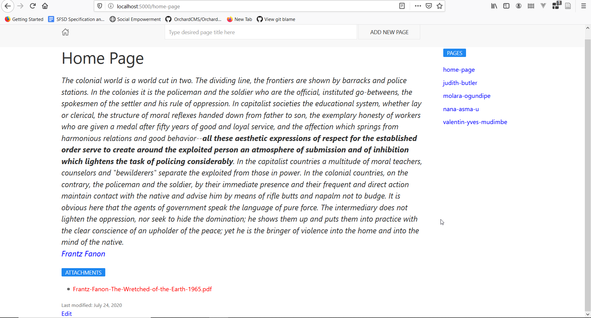

# Wiki

This is an experimental wiki to figure out better ways to write and organize ideas. The ideas being experimented here includes:

- Federated Wiki
- Numbered Entries

**Note**. This wiki requires preview features of C# 9 that is only available on [.NET 5 SDK](https://dotnet.microsoft.com/download/dotnet/5.0).

- It supports markdown
- You can rename pages
- It is stored using LiteDB
- It has a nice markdown editor
- You can upload attachments in every page
- You can delete attachments
- You can delete pages
- It has pages and attachment markdown linking helpers
- Namespace support. Each namespace is marked by url segment, e.g. `/recruitment/about` means `about` page under `recruitment` namespace. It can also go multiple levels of namespace e.g. `/recruitment/2020/about` -- the namespace is `recruitment/2020`.
- Basic search functionality 

Used libraries:

* Storage - [LiteDB](https://github.com/mbdavid/LiteDB).
* Framework - [FeatherHttp](https://github.com/featherhttp/framework).
* Text Template - [Scriban](https://github.com/lunet-io/scriban).
* Markdown Support - [Markdig](https://github.com/lunet-io/markdig).
* Validation - [FluentValidation](https://github.com/FluentValidation/FluentValidation).
* Html Generation - [HtmlBuilders](https://github.com/amoerie/HtmlBuilders).
* Markdown Editor - [EasyMDE](https://github.com/Ionaru/easy-markdown-editor).
* Sanitizing Input - [HtmlSanitizer](https://github.com/mganss/HtmlSanitizer).
* Search - [lunr-core](https://github.com/bleroy/lunr-core).

**Screenshot**
